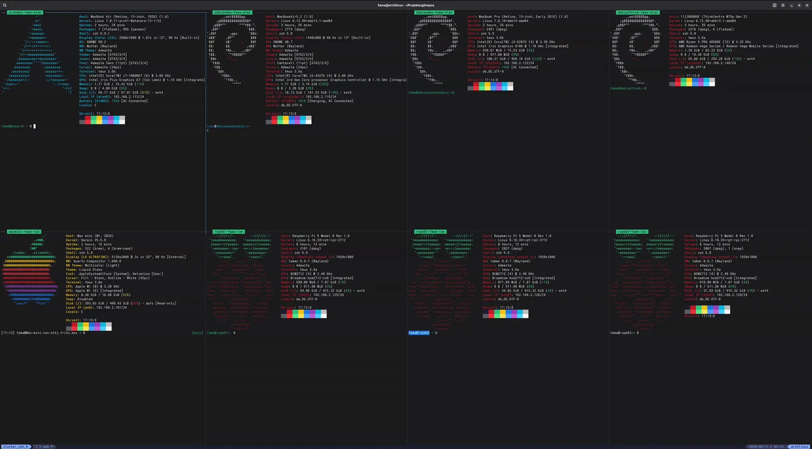

## Hi there 👋

### 🔭 I’m currently working on

#### Keeping my cluster awake

---
 

### 📏 My repositories statistics

**# Repos**: 11

**# Files**: 575

| Type | Files | Lines | &nbsp;&nbsp;&nbsp;&nbsp;&nbsp; | Type | Files|
|---|---|---|---|---|---|
| Shell                 | **4**        | **385**                |  | VS Solution           | **2**        |
| Python                | **7**        | **1573**               |  | Clips                 | **5**        |
| ObjC++                | **3**        | **404**                |  | Images                | **239**      |
| Css                   | **2**        | **19**                 |  | .Net C# Project       | **4**        |
| Json                  | **19**       | **419**                |  | Xcode Project         | **3**        |
| Vue                   | **7**        | **626**                |  | CSV                   | **4**        |
| Patch                 | **24**       | **1868**               |  | Autosar               | **6**        |
| Html                  | **2**        | **35**                 |  | Xcode CoreData        | **6**        |
| Expect                | **1**        | **35**                 |  | Xcode Workspace       | **3**        |
| Xsd                   | **1**        | **116**                |  | PyTorch Model         | **1**        |
| C#                    | **20**       | **2372**               |  | Fonts                 | **3**        |
| Z-Shell               | **30**       | **6573**               |  | Change Log Files      | **3**        |
| Swift                 | **47**       | **1673**               |  | SSL Keys              | **6**        |
| Xml                   | **1**        | **46**                 |  | Swift Package         | **2**        |
| Xquery                | **1**        | **147**                |  | License Files         | **15**       |
| C                     | **2**        | **19**                 |  |                       |              |
| C++                   | **5**        | **1040**               |  |                       |              |
| JS                    | **9**        | **429**                |  |                       |              |
| Xcode Config          | **5**        | **100**                |  |                       |              |
| ObjC                  | **2**        | **183**                |  |                       |              |
| Text                  | **4**        | **9**                  |  |                       |              |
| Docker Files          | **6**        | **202**                |  |                       |              |
| Make Files            | **2**        | **138**                |  |                       |              |
| VS Code Config        | **7**        | **411**                |  |                       |              |
| Git Config            | **16**       | **623**                |  |                       |              |
| Readme Files          | **44**       | **7593**               |  |                       |              |
| Darktable             | **2**        | **67**                 |  |                       |              |