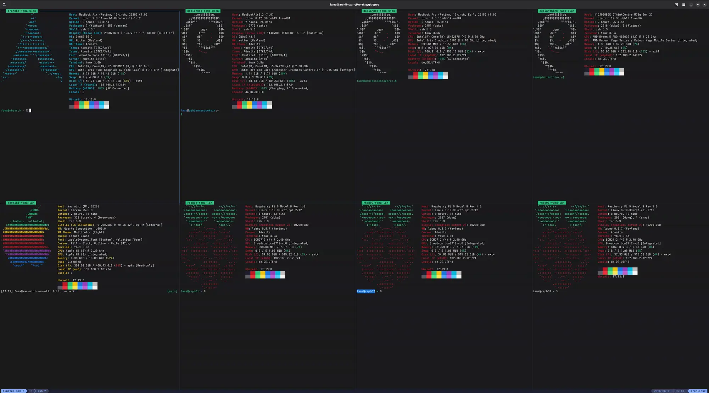

### 🤖 kindly helped me learn `tmux`:

[`tmux_cluster.zsh`](./zsh/tmux_cluster.zsh):

---

### 📏 Repositories Statistics

Status: 19.08.2026 12:17:09

**# Repos**: 13 (3 private, 10 public)

**# Files**: 1149

  
Details

| Type | Files | Lines | &nbsp;&nbsp;&nbsp;&nbsp;&nbsp; | Type | Files|
|---|---|---|---|---|---|
| Shell                 | **4**        | **385**                |  | PDF Files             | **51**       |
| Python                | **9**        | **1728**               |  | Clips                 | **5**        |
| ObjC++                | **3**        | **404**                |  | VS Solution           | **2**        |
| Css                   | **2**        | **19**                 |  | Images                | **282**      |
| Json                  | **76**       | **11287**              |  | .Net C# Project       | **4**        |
| Patch                 | **24**       | **1868**               |  | SQLite Data Files     | **5**        |
| Vue                   | **8**        | **712**                |  | SSL Keys              | **6**        |
| Expect                | **1**        | **35**                 |  | Xcode Project         | **4**        |
| Html                  | **2**        | **35**                 |  | CSV                   | **4**        |
| Xsd                   | **1**        | **116**                |  | Autosar               | **6**        |
| C#                    | **20**       | **2372**               |  | Xcode Storyboard      | **34**       |
| Z-Shell               | **40**       | **7959**               |  | Xcode CoreData        | **6**        |
| Swift                 | **47**       | **1673**               |  | Xcode Workspace       | **3**        |
| Xml                   | **1**        | **46**                 |  | PyTorch Model         | **1**        |
| Xquery                | **1**        | **147**                |  | Fonts                 | **3**        |
| C                     | **184**      | **10758**              |  | Change Log Files      | **3**        |
| C++                   | **6**        | **1118**               |  | Swift Package         | **2**        |
| JS                    | **9**        | **429**                |  | License Files         | **16**       |
| ObjC                  | **175**      | **38394**              |  |                       |              |
| Xcode Config          | **5**        | **100**                |  |                       |              |
| Text                  | **5**        | **11**                 |  |                       |              |
| Readme Files          | **51**       | **8174**               |  |                       |              |
| Docker Files          | **7**        | **254**                |  |                       |              |
| Git Config            | **20**       | **677**                |  |                       |              |
| Make Files            | **2**        | **138**                |  |                       |              |
| VS Code Config        | **7**        | **411**                |  |                       |              |
| Darktable             | **2**        | **67**                 |  |                       |              |

> **Statistics generated with:**
> 1. Run `gh_clone_all_repos_not_forked` from [`.zshrc`](./zsh/.zshrc)
> 2. Run [`repo_statistic.zsh`](./zsh/repo_statistic.zsh)
>

